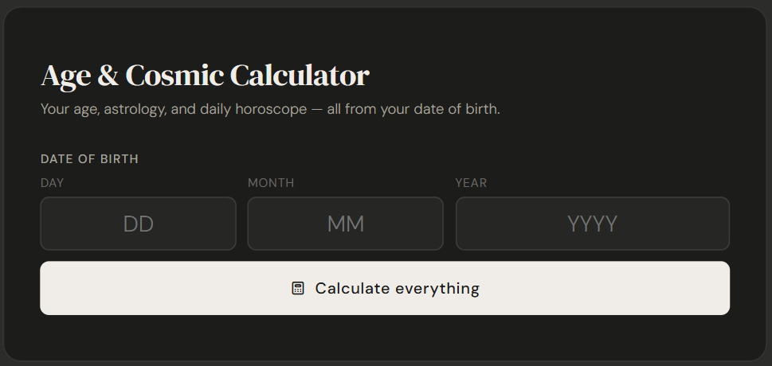
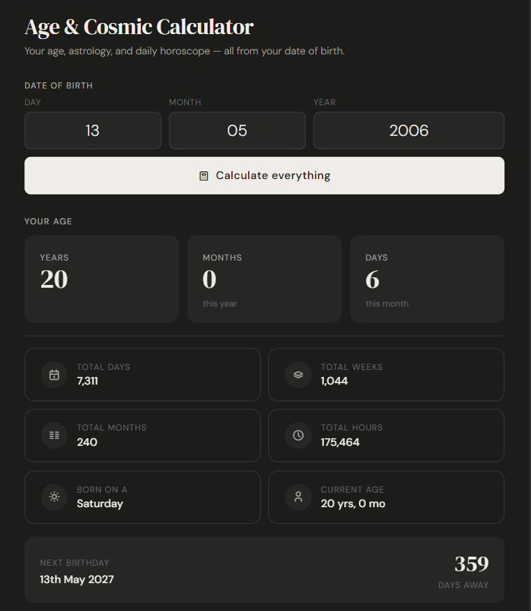
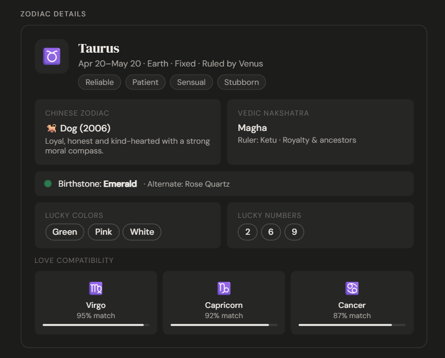
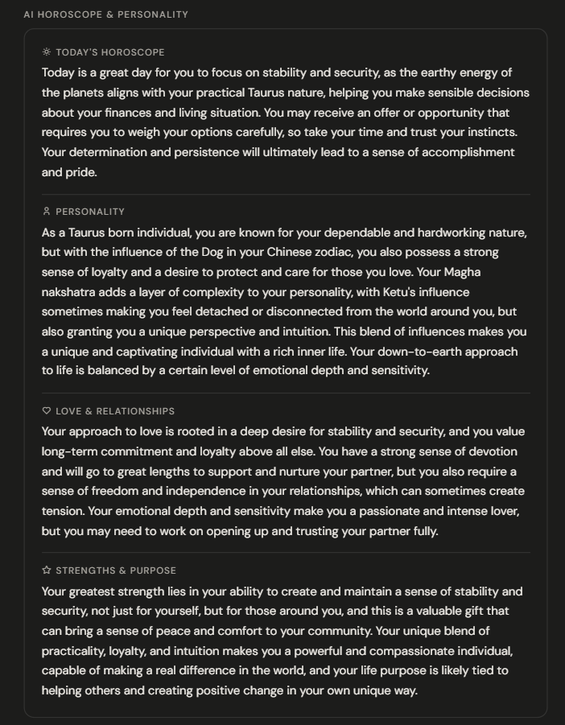

# 🌌 Age & Cosmic Calculator

An AI-powered web application that combines advanced age analytics with astrology-based cosmic insights, zodiac interpretation, compatibility analysis, and personalized horoscope generation — all within a modern responsive interface.

---

## ✨ Features

### 📅 Advanced Age Analytics
- Precise age calculation in:
  - Years
  - Months
  - Days
  - Weeks
  - Hours
- Birthday countdown tracker
- Leap year handling
- Real-time date validation

### 🔮 Astrology & Cosmic Insights
- Western Zodiac system
- Chinese Zodiac analysis
- Vedic Nakshatra insights
- Personality trait generation
- Element & ruling planet detection
- Birthstone recommendations
- Lucky numbers & colors

### ❤️ Compatibility System
- Zodiac compatibility analysis
- Match percentage visualization
- Relationship insight generation

### 🤖 AI Horoscope Engine
- AI-generated daily horoscope
- Personality analysis
- Dynamic cosmic readings
- Personalized interpretations

### 🎨 Premium UI/UX
- Fully responsive design
- Dark/Light mode adaptation
- Animated interface components
- Modern responsive layout
- Mobile-friendly interface

---

## 🚀 Technologies Used

- HTML5
- CSS3
- JavaScript (Vanilla JS)
- REST APIs
- AI/LLM Integration
- Responsive Web Design

---

## 🧠 Project Highlights

- Built as a complete single-page application
- Advanced astrology mapping logic
- Complex date-processing algorithms
- Dynamic horoscope rendering
- Interactive compatibility engine
- Real-time user input validation
- Premium dark-themed UI design

---

## 📸 Screenshots

### 🏠 Home Interface


---

### 📊 Age Analytics Dashboard


---

### 🔮 Zodiac & Compatibility Insights


---

### 🤖 AI Horoscope & Personality Analysis


---

## ⚙️ Usage

Open `index.html` in any modern browser to run the application locally.

---

## 🔐 Security Note

API keys are removed from the public repository for security purposes.

---

## 📂 Project Structure

```txt
age-cosmic-calculator/
│
├── assets/
│   ├── age-dashboard.png
│   ├── ai-horoscope.png
│   ├── home-interface.png
│   └── zodiac-details.png
│
├── index.html
├── README.md
└── LICENSE
```

---

## 🔮 Future Enhancements

- Voice assistant integration
- Personalized user accounts
- AI relationship analysis
- Daily notification system
- Multi-language support
- Mobile app deployment

---

## 👩‍💻 Author

### Veda
AI & ML Student | Frontend + AI Developer

- GitHub: https://github.com/M-Veda
- LinkedIn: https://linkedin.com/in/veda-m

---

## 📜 License

This project is licensed under the MIT License.

---

## ⭐ Support

If you liked this project:

- ⭐ Star the repository
- 🍴 Fork the project
- 🧠 Explore the code
- 🚀 Share feedback

---

## 💫 Project Vision

Age & Cosmic Calculator was designed to merge utility, AI, astrology, and immersive frontend experiences into a single modern web application that feels both intelligent and visually engaging.